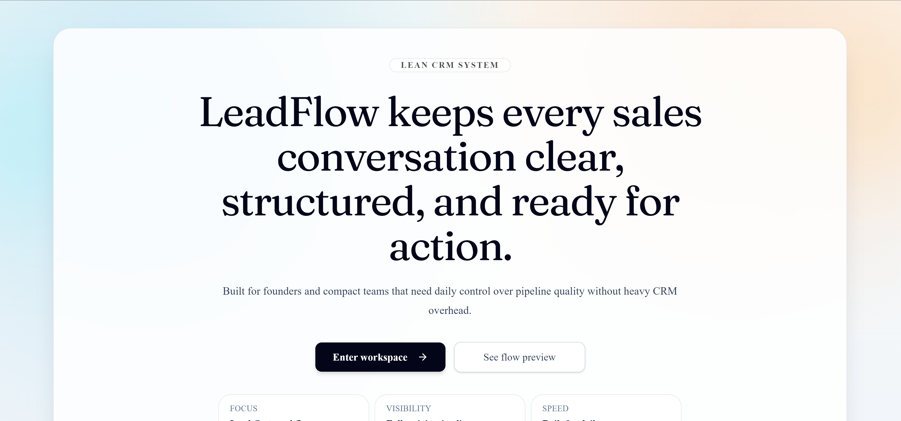
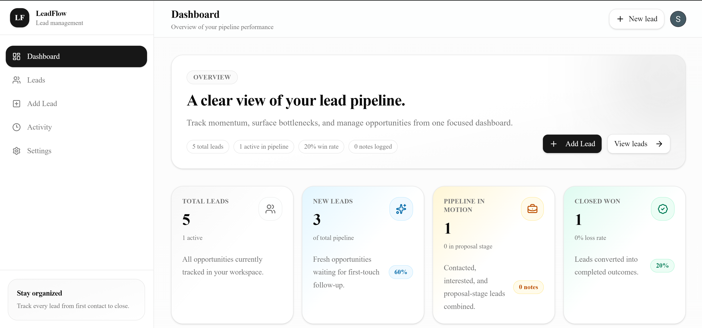
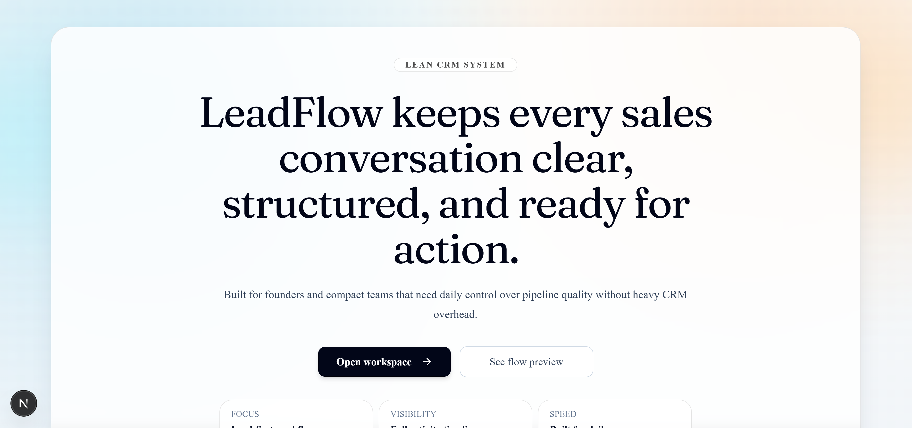
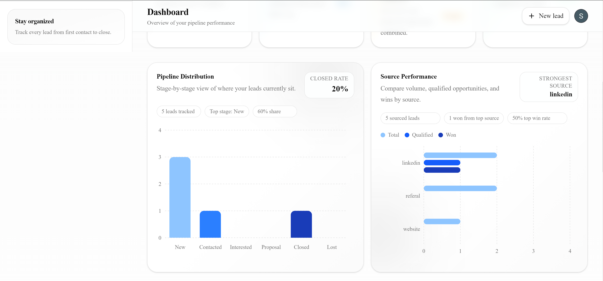
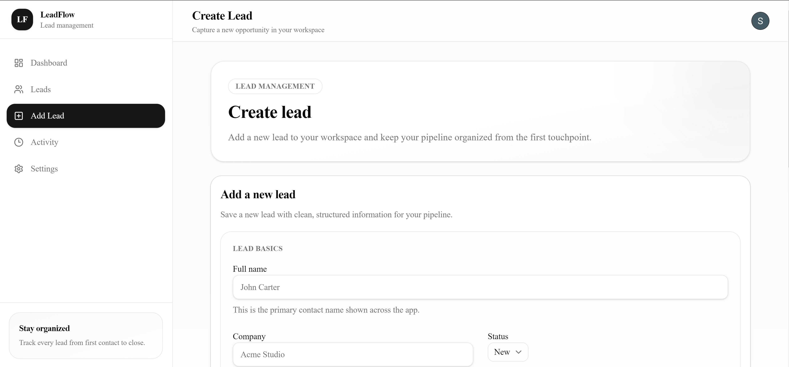

# Lead Flow

Lead Flow is a modern full-stack CRM-style SaaS app built for managing leads, tracking pipeline activity, and making the workflow more organized with AI support.

I built it with a production-style stack, focusing on authenticated dashboards, lead management, clean UI, and secure server-side logic.

## Live Demo

[View live app](https://lead-flow-fstg89v0n-skerdids-projects.vercel.app/)

## Overview

Lead Flow is designed as a startup-style lead management platform where each user can:

- create and manage their own leads
- organize pipeline data inside a clean dashboard
- monitor pipeline momentum with visual charts for stages and lead sources
- update lead details through validated server actions
- use an AI-powered assistant inside the app
- work in a protected authenticated experience

This project was built to show full-stack product thinking, not just separate UI pages.

## Features

- Authentication with Clerk
- Protected dashboard routes
- Lead creation, editing, and deletion
- Dashboard charts for pipeline stage distribution and source performance
- Per-user data ownership
- AI chat assistant
- Server-side validation with Zod
- Database access with Drizzle ORM
- PostgreSQL database integration
- Bot/rate-limit protection with Arcjet
- Responsive SaaS-style UI built with reusable components

## Testing & CI

Implemented a focused baseline (important checks only):

- Unit tests for lead form validation (`lib/validations/lead.test.ts`)
- API guardrail tests for chat route auth/content-type validation (`app/api/chat/route.test.ts`)
- CI pipeline via GitHub Actions (`.github/workflows/ci.yml`) that runs:
  - typecheck
  - tests
  - production build

## Tech Stack

### Frontend
- Next.js
- React
- TypeScript
- Tailwind CSS
- shadcn/ui

### Backend / Server
- Next.js App Router
- Server Actions
- API Routes
- Zod validation

### Auth / Database / Infra
- Clerk
- Drizzle ORM
- PostgreSQL
- Arcjet
- Vercel

### AI
- OpenAI via AI SDK

## LeadFlow Screenshoots

