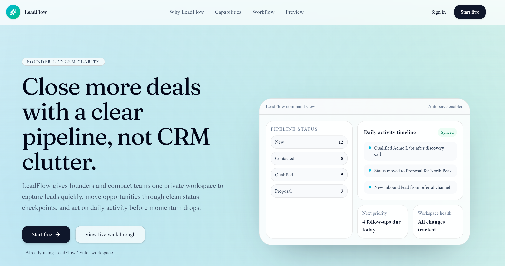
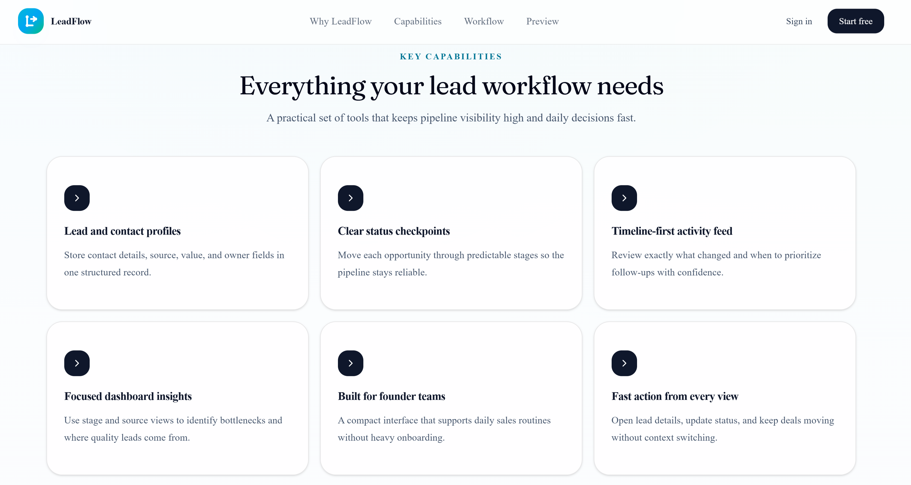
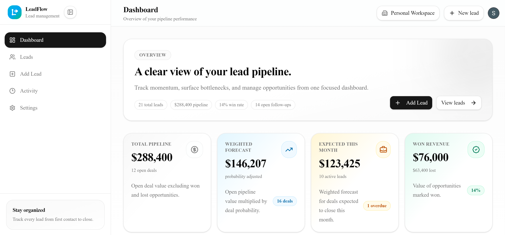
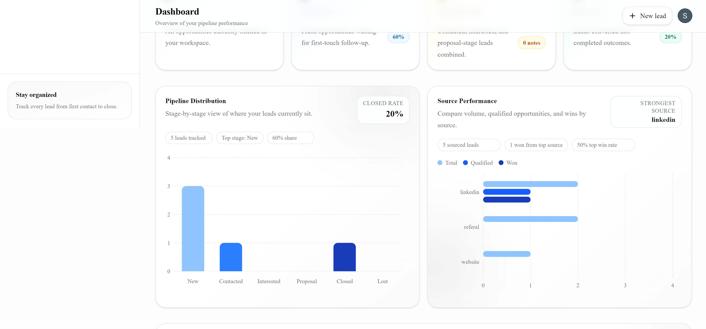
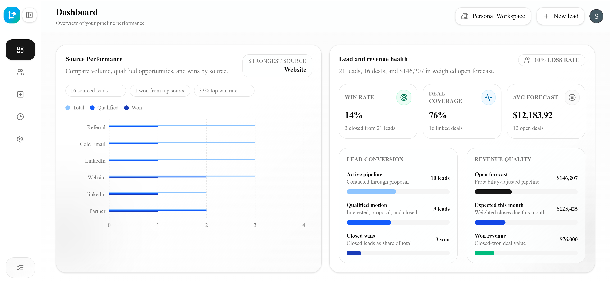
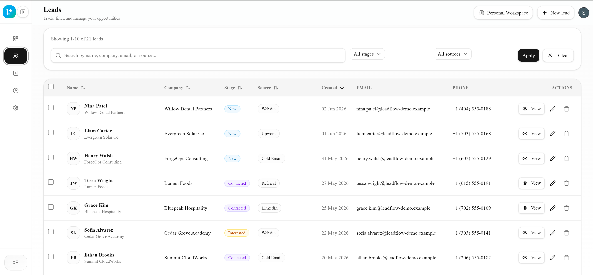
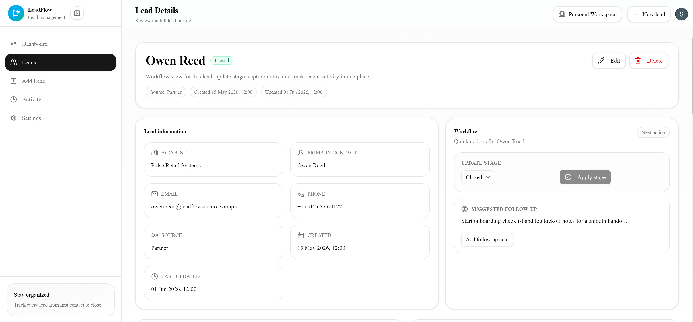
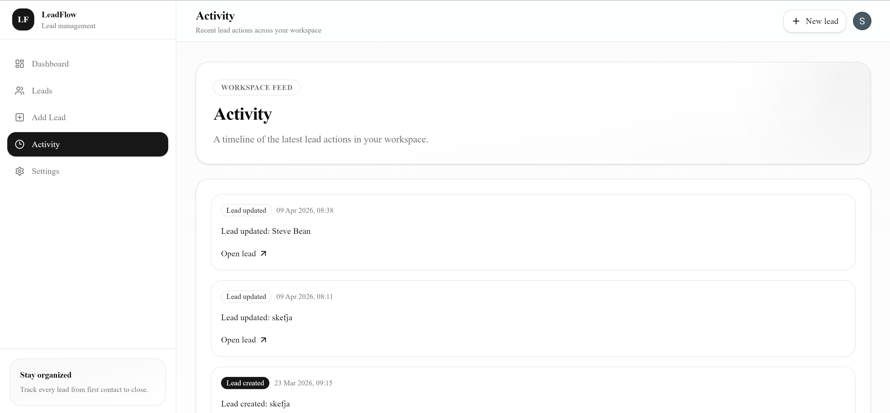

# Lead Flow

**Lead Flow** is a modern CRM-style SaaS application built with **Next.js**, **React**, **TypeScript**, **Clerk Auth**, **PostgreSQL**, **Drizzle ORM**, **Arcjet**, and a clean SaaS dashboard interface.

It demonstrates authentication, protected dashboards, lead management, activity tracking, revenue pipeline metrics, weighted forecasting, CSV/PDF exports, server-side validation, automated tests, CI, and production-minded UI/UX.

[Live Demo](https://lead-flow-jx61pjm6w-skerdids-projects.vercel.app/) | [Repository](https://github.com/skerdiD/lead-flow)


### Landing Page




### CRM Dashboard





### Leads Workspace





---

## Overview

Most CRM demos stop at a basic table of contacts. Lead Flow was built to feel closer to a real SaaS lead-management product with authentication, protected dashboard routes, lead CRUD, activity tracking, revenue forecasting, exports, testing, and a polished interface.

The goal was to show more than CRUD: secure server actions, database modeling, dashboard analytics, business-focused pipeline tracking, export workflows, and product-focused UX.

---

## Business Value

Lead Flow demonstrates how a CRM can help freelancers, agencies, startups, and small sales teams organize leads, track opportunities, and understand pipeline value.

For clients, it shows the foundation of a practical sales tool where users can manage leads, monitor activity, export reports, and view revenue-focused metrics like total pipeline value, weighted forecast, expected revenue, won revenue, and lost revenue.

---

## Key Features

### Auth and Access

* Clerk authentication
* Protected dashboard routes
* Per-user data ownership
* Secure access to lead data
* Test-mode auth support for E2E flows

### Lead Management

* Create, edit, and delete leads
* Track lead status and source
* Store contact details
* Filter and paginate lead records
* Manage leads inside a focused workspace

### Revenue Pipeline

* Deal value tracking
* Currency support
* Probability percentage
* Expected close date
* Closed date tracking
* Lost reason support
* Open, won, and lost revenue visibility

### Forecasting and Analytics

* Total pipeline value
* Weighted forecast value
* Expected revenue this month
* Won revenue
* Lost revenue
* Pipeline value by stage
* Lead source performance charts
* Activity timeline

### Exports

* CSV export for lead data
* PDF export for lead data
* Download flows covered by E2E tests
* Useful for reporting and offline review

### Security and Quality

* Protected server actions
* Zod validation
* Server-side auth checks
* User-scoped database access
* Arcjet bot and rate-limit protection
* Mutation guardrails
* Responsive SaaS interface

---

## Tech Stack

### Frontend

* Next.js App Router
* React
* TypeScript
* Tailwind CSS
* shadcn/ui
* Recharts

### Backend and Database

* Next.js Server Actions
* Next.js API Routes
* PostgreSQL
* Drizzle ORM
* Zod validation
* Typed database schema

### Auth and Security

* Clerk
* Arcjet
* Environment-based secrets
* Vercel deployment

### Tooling

* Vitest
* Playwright
* ESLint
* TypeScript compiler
* Drizzle Kit
* GitHub Actions

---

## Architecture

```txt
Client UI
  |-- Next.js App Router / React / Tailwind / shadcn UI
  |-- Dashboard Cards / Charts / Lead Forms / Export Buttons

Server Layer
  |-- Server Actions / API Routes / Zod Validation
  |-- Auth Checks / Arcjet Protection / Export Routes

Database Layer
  |-- PostgreSQL / Drizzle ORM
  |-- Leads / Activity Events / Revenue Pipeline Fields

CRM Layer
  |-- Lead Status / Lead Sources / Activity Timeline
  |-- CSV Export / PDF Export / Dashboard Analytics

Revenue Layer
  |-- Deal Value / Probability / Expected Close Date
  |-- Total Pipeline / Weighted Forecast / Won and Lost Revenue
```

Lead data is scoped to the authenticated user, important mutations are validated on the server, and dashboard analytics turn CRM activity into useful business metrics.

---

## Getting Started

### 1. Clone the repository

```bash
git clone https://github.com/skerdiD/lead-flow.git
cd lead-flow
```

### 2. Install dependencies

```bash
npm install
```

### 3. Create environment variables

Create a `.env.local` file in the project root:

```env
NEXT_PUBLIC_CLERK_PUBLISHABLE_KEY=
CLERK_SECRET_KEY=
DATABASE_URL=
ARCJET_KEY=
```

To enable the public role-selection demo, also configure the three dedicated
Clerk users and explicitly turn the feature on:

```env
DEMO_LOGIN_ENABLED=true
DEMO_OWNER_EMAIL=leadflow-demo@example.com
DEMO_ADMIN_EMAIL=leadflow-demo-admin@example.com
DEMO_MEMBER_EMAIL=leadflow-demo-member@example.com
```

`/demo` remains unavailable until `DEMO_LOGIN_ENABLED` is exactly `true`. The
demo sign-in endpoint accepts only the Owner, Admin, or Member role value, then
verifies that the configured Clerk user has the matching membership in the
dedicated demo workspace before issuing a five-minute sign-in token.

### 4. Run database migrations

```bash
npm run db:migrate
```

Use `npm run db:generate` only after changing `db/schema.ts`, then review and commit the generated migration files.

### 5. Seed screenshot data

To populate screenshot-ready CRM data for the existing Clerk user `skerdi0005@gmail.com`, make sure `DATABASE_URL` and `CLERK_SECRET_KEY` are set, then run:

```bash
npm run db:seed:screenshots
```

The seed finds that Clerk user by email, uses the matching Clerk user id for ownership, and replaces only the known fake screenshot leads in that user's workspace. Empty or seed-only workspaces are named `Lead Flow Demo Workspace`; workspaces with other leads keep their existing name. It does not create a public demo account or bypass authentication.

### 6. Seed the role-selection demo

After configuring the three `DEMO_*_EMAIL` values above, create or refresh the
isolated shared demo workspace:

```bash
npm run db:seed:demo
```

The seed creates the dedicated Clerk identities and assigns exactly one Owner,
Admin, and Member membership. The login flow never creates users, changes
memberships, or resets demo data.

### 7. Start the development server

```bash
npm run dev
```

Open the app at:

```txt
http://localhost:3000
```

---

## Available Scripts

```bash
npm run dev          # Start the development server
npm run build        # Create a production build
npm run start        # Start the production server
npm run lint         # Run ESLint
npm run typecheck    # Run TypeScript checks
npm run test         # Run Vitest tests
npm run db:generate  # Generate Drizzle migrations
npm run db:migrate   # Apply Drizzle migrations
npm run db:seed:screenshots # Seed screenshot-ready CRM data
npm run db:seed:demo # Seed the Owner, Admin, and Member demo workspace
npm run e2e:install  # Install Playwright browsers
npm run e2e          # Run Playwright E2E tests
npm run e2e:headed   # Run Playwright tests in headed mode
```

---

## Testing and Quality

* Vitest validates lead logic, validators, queries, and mutation guardrails
* Playwright validates protected dashboard flows and lead actions
* TypeScript catches type-level regressions
* ESLint keeps code quality consistent
* GitHub Actions runs checks on push and pull request
* E2E tests cover create, edit, delete, status changes, CSV export, and PDF export

Run the main quality suite:

```bash
npm run typecheck
npm run test
npm run build
```

Run browser tests:

```bash
npm run e2e:install
npm run e2e
```

---

## Author

Built by **skerdiD**.

GitHub: [@skerdiD](https://github.com/skerdiD)
