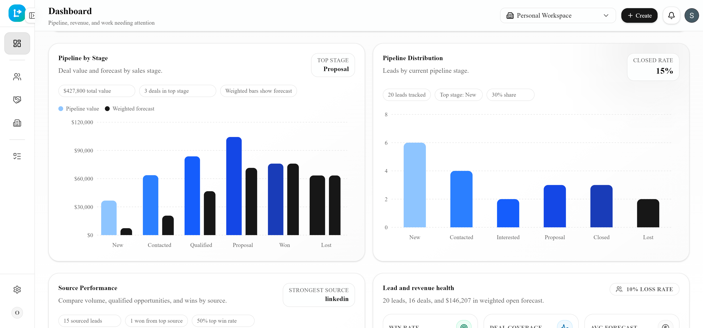
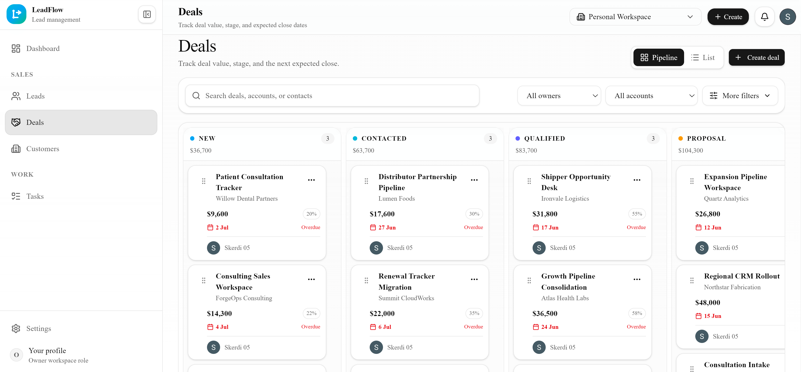
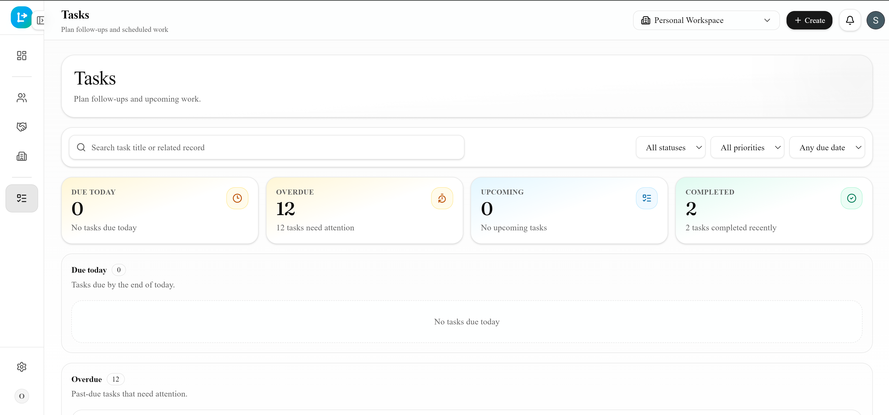

# Lead Flow

**Lead Flow** is a modern multi-tenant CRM SaaS application built with **Next.js**, **React**, **TypeScript**, **Clerk Auth**, **PostgreSQL**, **Drizzle ORM**, **Arcjet**, and a clean responsive SaaS dashboard.

It demonstrates authentication, workspace-based authorization, lead management, accounts, contacts, deals, pipeline tracking, activity history, tasks, forecasting, imports, CSV/PDF exports, idempotent mutations, database integrity, automated tests, CI, and production-minded security and UI/UX.

[Live Demo](https://lead-flow-jx61pjm6w-skerdids-projects.vercel.app/) | [Repository](https://github.com/skerdiD/lead-flow)

## Preview

### Dashboard overview


### Pipeline analytics



### Leads workspace


### Deals pipeline



### Tasks workspace



---

## Overview

Most CRM demos stop at a basic table of contacts. Lead Flow was built to feel closer to a real SaaS CRM with authentication, multi-tenant workspaces, role-based access, lead management, accounts, contacts, deals, tasks, activity tracking, revenue forecasting, imports, exports, testing, and a polished interface.

The goal was to demonstrate more than CRUD: secure server actions, capability-based authorization, relational database modeling, transactional business workflows, dashboard analytics, pipeline management, idempotency, database constraints, and product-focused UX.

---

## Business Value

Lead Flow demonstrates how freelancers, agencies, startups, and small sales teams can organize prospects, companies, contacts, opportunities, and follow-ups in one CRM workspace.

Users can manage the complete sales workflow from an initial lead to an account, contact, and revenue opportunity while tracking activity and understanding pipeline performance.

The dashboard provides business-focused metrics including total pipeline value, weighted forecast, expected revenue, won revenue, lost revenue, and pipeline value by stage.

---

## Key Features

### Auth and Access

* Clerk authentication
* Protected dashboard routes
* Multi-tenant workspaces
* Owner, Admin, and Member roles
* Capability-based authorization
* Workspace membership management
* Workspace invitation flow
* Ownership transfer
* Server-side permission checks
* Workspace-scoped database access
* Safe E2E authentication support

Workspace ownership is represented through the membership system, with exactly one member holding the `owner` role.

### Lead Management

* Create and edit leads
* Archive and restore leads
* Track lead status and source
* Store contact and company details
* Assign workspace owners
* Follow-up dates and priority
* Search, filter, and paginate records
* Dedicated lead detail pages
* Lead notes
* Lead activity timeline
* Lead-linked tasks
* Related account, contact, and deal information

### Lead Qualification

Leads can move through a structured CRM qualification workflow:

```text
Lead
  ↓
Account + Contact + Deal
```

The workflow supports:

* Creating or selecting an account
* Creating or selecting a contact
* Creating a related deal
* Carrying lead information into CRM records
* Duplicate protection
* Workspace validation
* Transactional qualification
* `lead_qualified` activity tracking
* Audit logging

### Accounts and Contacts

* Dedicated accounts workspace
* Dedicated contacts workspace
* Company and organization records
* Individual contact records
* Workspace-scoped relationships
* Relationships between leads, contacts, accounts, and deals

### Deal Pipeline

* Dedicated deals workspace
* Pipeline and list views
* Deal cards grouped by stage
* Drag-and-drop with `dnd-kit`
* Keyboard-accessible stage movement
* Deal value and currency
* Probability percentage
* Expected close date
* Closed date tracking
* Lost reason support
* Assigned deal owner
* Total value per pipeline stage
* Weighted value per stage
* Optimistic stage updates with rollback

Deal stage transitions are handled transactionally so deal state, activity events, and audit events stay consistent.

### Revenue Pipeline

* Deal value tracking
* Currency validation
* Probability tracking
* Expected close dates
* Won and lost deal tracking
* Lost reason enforcement
* Open pipeline visibility
* Weighted revenue calculations

### Forecasting and Analytics

* Total pipeline value
* Weighted forecast value
* Expected revenue this month
* Won revenue
* Lost revenue
* Pipeline value by stage
* Lead source performance charts
* Recent activity timeline

### Tasks and Follow-Ups

* CRM task management
* Pending and completed task states
* Due dates
* Task priorities
* Completion timestamps
* Lead-linked tasks
* Upcoming follow-ups
* Follow-up tracking inside lead details

### Activity and Audit History

* CRM activity timeline
* Lead activity
* Deal stage changes
* Task activity
* Qualification events
* Workspace activity
* Administrative audit logging
* Actor and workspace context
* Before/after state support for sensitive mutations

### Imports

* CSV CRM imports
* Import job tracking
* Row-level validation
* Field mapping
* Normalized imported data
* Duplicate detection
* Import warnings and errors
* Import status tracking
* Safe workspace-scoped processing

### Exports

* CSV export for lead data
* PDF export for lead data
* Server-side authorization
* Workspace-scoped exports
* Download flows covered by E2E tests
* Useful for reporting and offline review

### Security and Reliability

* Protected server actions
* Centralized capability-based authorization
* Zod validation
* Server-side authentication checks
* Workspace-level tenant isolation
* Arcjet bot protection
* Action-sensitive rate limiting
* PostgreSQL transactions
* PostgreSQL-backed idempotency
* Request fingerprinting
* Duplicate mutation protection
* Audit logging
* Security response headers
* Environment validation
* Mutation guardrails

### Database Integrity

PostgreSQL constraints protect important CRM invariants including:

* One owner per workspace
* Valid workspace relationships
* Task completion consistency
* Archive timestamp consistency
* Deal probability limits
* Non-negative deal values
* Closed deal consistency
* Lost reason requirements
* Currency format
* Invitation state consistency
* Idempotency uniqueness

### UI and UX

* Responsive SaaS dashboard
* Desktop, tablet, and mobile support
* Responsive sidebar navigation
* Mobile-friendly tables and forms
* Horizontally scrollable deal pipeline
* Route-level loading states
* Content-shaped skeletons
* Route-level error handling
* Dedicated not-found states
* Context-aware empty states
* Optimistic UI with rollback
* Accessible dialogs and controls

---

## Tech Stack

### Frontend

* Next.js App Router
* React
* TypeScript
* Tailwind CSS
* shadcn/ui
* Recharts
* dnd-kit

### Backend and Database

* Next.js Server Actions
* Next.js API Routes / Route Handlers
* PostgreSQL
* Drizzle ORM
* Zod validation
* PostgreSQL transactions
* Typed database schema

### Auth and Security

* Clerk
* Arcjet
* Capability-based authorization
* Workspace tenant isolation
* Security headers
* Environment-based secrets
* Vercel deployment

### Email

* Workspace invitation emails

### Tooling

* Vitest
* Playwright
* ESLint
* TypeScript compiler
* Drizzle Kit
* GitHub Actions

---

## Architecture

```txt
Client UI
  |-- Next.js App Router / React / Tailwind / shadcn UI
  |-- Dashboard / Leads / Accounts / Contacts / Deals / Tasks
  |-- Pipeline / Imports / Notifications / Settings

Server Layer
  |-- Server Actions / API Routes / Zod Validation
  |-- Clerk Authentication / Arcjet Protection
  |-- Rate Limiting / Idempotency / Request Validation

Authorization Layer
  |-- Workspace Membership
  |-- Owner / Admin / Member Roles
  |-- Capability-Based Permissions
  |-- Workspace-Scoped Resource Access

Database Layer
  |-- PostgreSQL / Drizzle ORM
  |-- Workspaces / Members / Invitations
  |-- Leads / Accounts / Contacts / Deals / Tasks
  |-- Activity / Audit Logs / Imports / Idempotency

CRM Layer
  |-- Lead Qualification
  |-- Deal Pipeline
  |-- Tasks / Follow-Ups
  |-- Activity Tracking
  |-- CSV/PDF Exports

Revenue Layer
  |-- Deal Value / Probability / Expected Close Date
  |-- Pipeline Value / Weighted Forecast
  |-- Won and Lost Revenue
```

CRM data is scoped to the active workspace. Authentication identifies the user, workspace membership determines access, and capability-based authorization determines which operations that user may perform.

Important multi-record mutations use PostgreSQL transactions, while retry-sensitive operations use database-backed idempotency protection.

---

## Available Scripts

```bash
npm run dev                 # Start development server
npm run build               # Create production build
npm run start               # Start production server
npm run lint                # Run ESLint
npm run typecheck           # Run TypeScript checks
npm run test                # Run Vitest tests
npm run db:generate         # Generate Drizzle migrations
npm run db:migrate          # Apply database migrations
npm run db:seed:screenshots # Seed screenshot-ready CRM data
npm run db:seed:demo        # Seed demo workspace
npm run e2e:install         # Install Playwright browsers
npm run e2e                 # Run Playwright E2E tests
npm run e2e:headed          # Run E2E tests in headed mode
```

---

## Testing and Quality

* Vitest validates authorization, validators, CRM logic, revenue calculations, idempotency, workspace rules, and mutation guardrails
* PostgreSQL integration tests validate database constraints and transactional behavior
* Playwright validates protected dashboard and CRM workflows
* E2E tests cover lead operations, status changes, exports, and important user flows
* TypeScript catches type-level regressions
* ESLint keeps code quality consistent
* GitHub Actions runs automated checks on push and pull request

Run the main quality suite:

```bash
npm run typecheck
npm run test
npm run build
```

Run browser tests:

```bash
npm run e2e:install
npm run e2e
```

---

## Author

Built by **skerdiD**.

GitHub: [@skerdiD](https://github.com/skerdiD)
