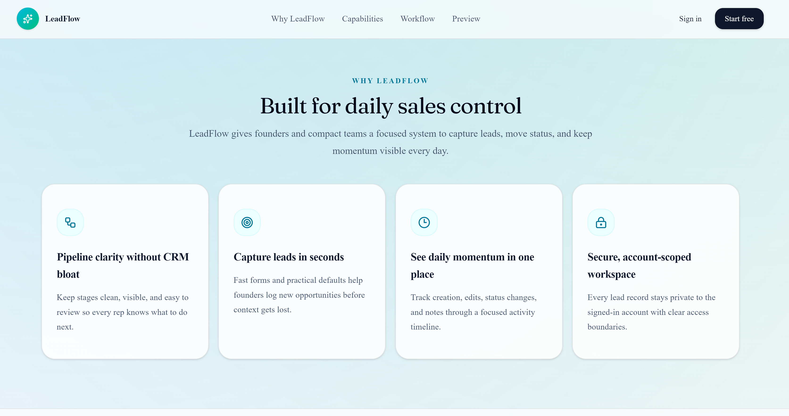
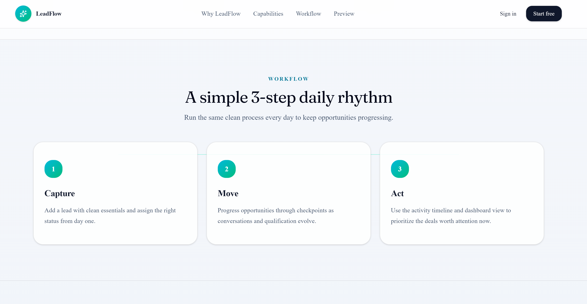
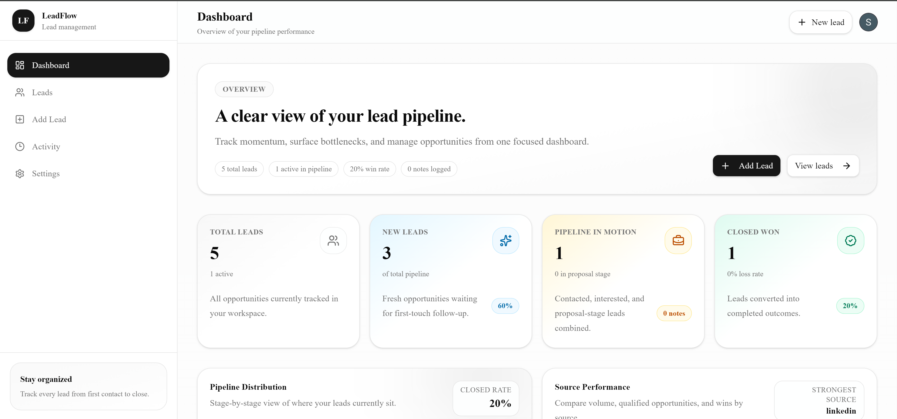
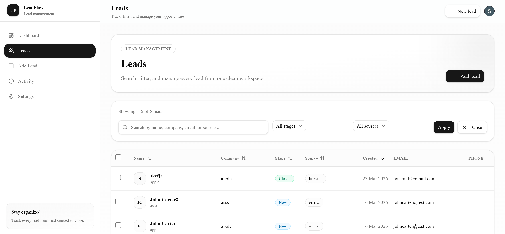
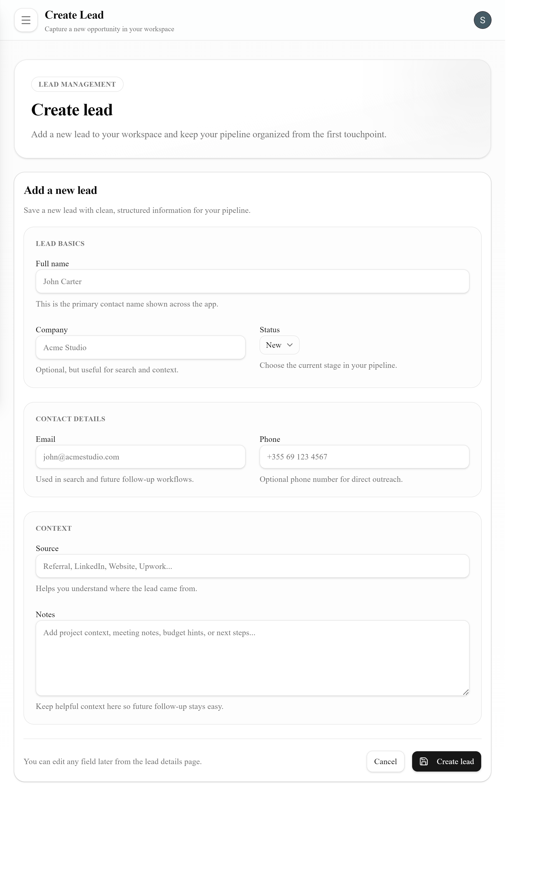

# Lead Flow

**Lead Flow** is a modern full-stack CRM-style SaaS application built for managing leads, tracking pipeline activity, exporting lead data, and supporting sales workflows with an AI assistant.

It demonstrates authentication, protected dashboards, lead CRUD, per-user data ownership, dashboard analytics, validated server actions, AI-powered assistance, CSV/PDF exports, automated tests, CI, and production-minded SaaS UI/UX.

[Live Demo](https://lead-flow-jx61pjm6w-skerdids-projects.vercel.app/) · [Features](#features) · [Tech Stack](#tech-stack) · [Getting Started](#getting-started) · [Testing and CI](#testing-and-ci)

---

## Preview

### Live App

https://lead-flow-jx61pjm6w-skerdids-projects.vercel.app/

### Landing Page Hero


### Why Lead Flow Section



### Workflow Section



### Dashboard Overview



### Dashboard Charts


### Leads Workspace



### Activity Timeline


### Mobile Create Lead View



---

## Overview

Most CRM demos stop at a basic table of contacts. Lead Flow was built to feel closer to a real SaaS lead-management product.

The app includes authenticated users, protected dashboard routes, lead creation and editing, pipeline tracking, source analytics, CSV/PDF export, an AI assistant, server-side validation, database persistence, bot/rate-limit protection, and a responsive premium interface.

The goal was not only to build a working CRUD app, but to show product thinking, user experience, secure server-side logic, database design, testing, and business value.

---

## Features

### Authentication and User Access

* Authentication with Clerk
* Protected dashboard routes
* Per-user data ownership
* Test-mode authentication support for E2E flows
* Secure access to dashboard and lead data

### Lead Management

* Create new leads
* Edit existing leads
* Delete leads
* Update lead status
* Track lead source
* Manage lead details inside a focused workspace
* Filter and paginate leads
* Export leads from `/dashboard/leads`

### Dashboard Analytics

* Pipeline overview cards
* Stage distribution charts
* Lead source performance charts
* Visual dashboard for understanding pipeline momentum
* Activity timeline for recent lead movement

### AI Assistant

* AI-powered assistant inside the app
* Chat API route with guardrails
* Auth and content-type protection
* Useful support for lead-management workflows

### Export Functionality

* CSV export for lead data
* PDF export for lead data
* Download checks covered by Playwright E2E tests
* Useful for reporting, sharing, and offline review

### Security and Validation

* Server-side validation with Zod
* Protected server actions
* Per-user database access patterns
* Arcjet bot/rate-limit protection
* API route guardrails
* Environment-variable based configuration

### Performance and UX

* Responsive SaaS-style dashboard
* Clean landing page
* Reusable UI components
* Mobile-friendly lead creation flow
* Smooth dashboard navigation
* Clear empty states and form interactions
* Production build support

---

## Tech Stack

### Frontend

* Next.js App Router
* React
* TypeScript
* Tailwind CSS
* shadcn/ui
* Recharts

### Backend and Server

* Next.js Server Actions
* API Routes
* Zod validation
* Drizzle ORM
* PostgreSQL

### Auth, Security, and Infra

* Clerk
* Arcjet
* Vercel
* Environment-based secrets

### Testing and Tooling

* Vitest
* Playwright
* TypeScript compiler
* GitHub Actions
* ESLint

---

## Architecture Overview

Lead Flow uses a modern full-stack architecture built around the Next.js App Router.

```txt
Client UI
  |-- Next.js App Router
  |-- React Components
  |-- Tailwind CSS / shadcn UI
  |-- Dashboard Charts
  |-- Lead Forms

Server Layer
  |-- Server Actions
  |-- API Routes
  |-- Zod Validation
  |-- Auth Checks
  |-- Arcjet Protection

Database Layer
  |-- PostgreSQL
  |-- Drizzle ORM
  |-- User-Owned Lead Records

AI Layer
  |-- Chat API Route
  |-- Auth Guardrails
  |-- Content-Type Validation

Quality Layer
  |-- TypeScript
  |-- Vitest
  |-- Playwright
  |-- GitHub Actions
```

The app keeps lead data tied to the authenticated user, validates important mutations on the server, and uses automated tests to protect the core product flow.

---

## Product Flow

1. A user visits the landing page.
2. The user signs in with Clerk.
3. The user enters the protected dashboard.
4. The user creates and manages leads.
5. The dashboard visualizes pipeline stages and lead sources.
6. The user can update, delete, filter, and paginate leads.
7. The user can export lead data as CSV or PDF.
8. The AI assistant supports workflow-related questions.
9. Tests and CI verify the most important product paths.

---

## Getting Started

### 1. Clone the repository

```bash
git clone https://github.com/skerdiD/lead-flow.git
cd lead-flow
```

### 2. Install dependencies

```bash
npm install
```

### 3. Create environment variables

Create a `.env.local` file in the root of the project.

```env
NEXT_PUBLIC_CLERK_PUBLISHABLE_KEY=
CLERK_SECRET_KEY=

DATABASE_URL=

ARCJET_KEY=

OPENAI_API_KEY=
```

Required for local app use:

* `DATABASE_URL` - PostgreSQL connection string used by Drizzle and the app
* `NEXT_PUBLIC_CLERK_PUBLISHABLE_KEY` and `CLERK_SECRET_KEY` - Clerk authentication
* `ARCJET_KEY` - Arcjet protection
* `OPENAI_API_KEY` - AI assistant route

If your AI provider uses a different key name, use the exact variable name configured in the project.

### 4. Run database migrations

```bash
npm run db:migrate
```

This project uses committed Drizzle migrations. Use `npm run db:generate` only after changing `db/schema.ts`, review the generated SQL, then commit the new migration and snapshot files.

Migration note: the file `db/migrations/0001_add_activity_events.sql` is intentionally retained under its original manual name for history. Drizzle applies migrations from `db/migrations/meta/_journal.json`, and that journal now includes the file in the safe migration order.

### 5. Start the development server

```bash
npm run dev
```

Open the app at:

```txt
http://localhost:3000
```

### 6. Run tests

```bash
npm run typecheck
npm run test
```

For browser E2E tests, install the Playwright browser first:

```bash
npm run e2e:install
npm run e2e
```

---

## Available Scripts

```bash
npm run dev          # Start the development server
npm run build        # Create a production build
npm run start        # Start the production server
npm run typecheck    # Run TypeScript checks
npm run lint         # Run ESLint
npm run test         # Run Vitest tests
npm run db:generate  # Generate a Drizzle migration after schema changes
npm run db:migrate   # Apply committed Drizzle migrations
npm run e2e:install  # Install Playwright browsers
npm run e2e          # Run Playwright E2E tests
npm run e2e:headed   # Run Playwright E2E tests in headed mode
```

---

## Testing and CI

Lead Flow includes focused automated coverage for the most important product paths.

### Unit and Server Action Tests

The test suite covers:

* Lead form validation rules
* Create lead server action
* Update lead server action
* Delete lead server action
* Lead list filtering
* Lead list pagination
* Chat API route guardrails
* Successful chat API request path

Example test locations:

```txt
lib/validations/lead.test.ts
app/dashboard/leads/actions.test.ts
app/dashboard/leads/queries.test.ts
app/api/chat/route.test.ts
```

### End-to-End Tests

Playwright covers core browser flows:

* Protected dashboard access in test auth mode
* Leads page load
* Create lead flow
* Edit lead flow
* Status change flow
* Delete lead flow
* CSV export download
* PDF export download

Example E2E location:

```txt
e2e/leads.spec.ts
```

### E2E Commands

```bash
npm run e2e:install
npm run e2e
npm run e2e:headed
```

Playwright starts the app in test mode with:

```txt
E2E_TEST_MODE=1
```

and uses a deterministic user id:

```txt
e2e-user
```

This allows protected dashboard flows to be tested without interactive Clerk sign-in.

### CI Pipeline

The GitHub Actions workflow runs on push and pull request.

CI executes:

```bash
npm ci
npm run typecheck
npm run test
npm run build
```

This helps verify type safety, business logic, tests, and production build readiness before changes are merged.

---

## What This Project Demonstrates

Lead Flow shows experience with more than basic CRUD development.

It demonstrates:

* Full-stack SaaS architecture
* Authenticated dashboard development
* CRM-style product flows
* Lead management logic
* User-owned data access
* Server-side validation
* Database modeling with Drizzle ORM
* API route guardrails
* AI feature integration
* Dashboard analytics and charts
* Export functionality
* Playwright E2E testing
* CI workflow setup
* Production-ready UI/UX thinking

---

## Business Value

Lead Flow represents the type of internal tool that freelancers, agencies, startups, and small sales teams need to organize pipeline activity and avoid losing potential customers.

From a business perspective, this project supports:

* Better lead organization
* Faster follow-up workflows
* Clear pipeline visibility
* Better understanding of lead sources
* Easier reporting through CSV/PDF exports
* AI-assisted workflow support
* A foundation for a paid CRM-style SaaS product

The strongest business value is not only the lead table itself, but the system around it: authentication, per-user data ownership, dashboard analytics, secure server actions, export functionality, and an interface that can grow into a real sales productivity platform.

---

## Author

Built by **skerdiD**.

GitHub: [@skerdiD](https://github.com/skerdiD)
